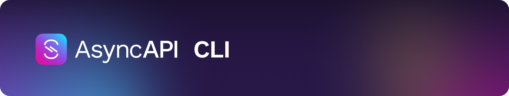

CLI to work with your AsyncAPI files. Currently under development, we are working to bring more features. 

## Table of contents

<!-- toc -->

- [Installation](#installation)
- [Usage](#usage)
- [Contributing](#contributing)
  * [Set up development environment](#set-up-development-environment)
  * [Command Structure and Patterns](#command-structure-and-patterns)
- [Contributors](#contributors)

<!-- tocstop -->

## Installation
Learn how to install the AsyncAPI CLI by following the instructions in the [installation guide](/docs/installation.md). 

## Usage
The [usage guide](/docs/usage.md) provides information about different ways to use the CLI.

## Contributing

Read [CONTRIBUTING](https://github.com/asyncapi/.github/blob/master/CONTRIBUTING.md) guide.

### Set up development environment

Read [DEVELOPMENT.md](/DEVELOPMENT.md) file for development setup.

Additional steps:

- Run `npm run test` to make sure everything is properly set up
- Run `npm run build` and then `bin/run` to try new CLI locally

The UX developed for the CLI should comply with the [Command Line Interface Guideline](https://clig.dev/)

### Command Structure and Patterns

We are following `verb + noun` and `namespace + noun + [verb]` pattern for making our commands and arguments. For example `asyncapi validate <spec-file-path>` and `asyncapi config context add <context-name> <spec-file-path>`.

## Contributors

Thanks go to these wonderful people ([emoji key](https://allcontributors.org/docs/en/emoji-key)):

<!-- ALL-CONTRIBUTORS-LIST:START - Do not remove or modify this section -->
<!-- prettier-ignore-start -->
<!-- markdownlint-disable -->
<table>
  <tbody>
    <tr>
      <td align="center" valign="top" width="14.28%"><a href="https://github.com/jotamusik"> <b>Jorge Aguiar Martín</b></a> <a href="https://github.com/asyncapi/cli/commits?author=jotamusik" title="Code">💻</a> <a href="#ideas-jotamusik" title="Ideas, Planning, & Feedback">🤔</a> <a href="https://github.com/asyncapi/cli/commits?author=jotamusik" title="Tests">⚠️</a> <a href="https://github.com/asyncapi/cli/commits?author=jotamusik" title="Documentation">📖</a></td>
      <td align="center" valign="top" width="14.28%"><a href="https://www.brainfart.dev/"> <b>Lukasz Gornicki</b></a> <a href="#ideas-derberg" title="Ideas, Planning, & Feedback">🤔</a> <a href="https://github.com/asyncapi/cli/commits?author=derberg" title="Code">💻</a> <a href="https://github.com/asyncapi/cli/pulls?q=is%3Apr+reviewed-by%3Aderberg" title="Reviewed Pull Requests">👀</a> <a href="#maintenance-derberg" title="Maintenance">🚧</a></td>
      <td align="center" valign="top" width="14.28%"><a href="https://souvik.vercel.app/"> <b>souvik</b></a> <a href="https://github.com/asyncapi/cli/commits?author=Souvikns" title="Code">💻</a> <a href="#ideas-Souvikns" title="Ideas, Planning, & Feedback">🤔</a> <a href="https://github.com/asyncapi/cli/commits?author=Souvikns" title="Tests">⚠️</a> <a href="https://github.com/asyncapi/cli/pulls?q=is%3Apr+reviewed-by%3ASouvikns" title="Reviewed Pull Requests">👀</a> <a href="#maintenance-Souvikns" title="Maintenance">🚧</a> <a href="https://github.com/asyncapi/cli/commits?author=Souvikns" title="Documentation">📖</a></td>
      <td align="center" valign="top" width="14.28%"><a href="https://boyney.io/"> <b>David Boyne</b></a> <a href="https://github.com/asyncapi/cli/commits?author=boyney123" title="Code">💻</a> <a href="#ideas-boyney123" title="Ideas, Planning, & Feedback">🤔</a> <a href="#maintenance-boyney123" title="Maintenance">🚧</a></td>
      <td align="center" valign="top" width="14.28%"><a href="http://www.fmvilas.com/"> <b>Fran Méndez</b></a> <a href="https://github.com/asyncapi/cli/commits?author=fmvilas" title="Code">💻</a> <a href="#ideas-fmvilas" title="Ideas, Planning, & Feedback">🤔</a> <a href="https://github.com/asyncapi/cli/pulls?q=is%3Apr+reviewed-by%3Afmvilas" title="Reviewed Pull Requests">👀</a></td>
      <td align="center" valign="top" width="14.28%"><a href="https://github.com/magicmatatjahu"> <b>Maciej Urbańczyk</b></a> <a href="https://github.com/asyncapi/cli/pulls?q=is%3Apr+reviewed-by%3Amagicmatatjahu" title="Reviewed Pull Requests">👀</a> <a href="#maintenance-magicmatatjahu" title="Maintenance">🚧</a> <a href="#ideas-magicmatatjahu" title="Ideas, Planning, & Feedback">🤔</a></td>
      <td align="center" valign="top" width="14.28%"><a href="https://aayushsahu.com/"> <b>Aayush Kumar Sahu</b></a> <a href="https://github.com/asyncapi/cli/commits?author=aayushmau5" title="Code">💻</a> <a href="https://github.com/asyncapi/cli/commits?author=aayushmau5" title="Tests">⚠️</a></td>
    </tr>
    <tr>
      <td align="center" valign="top" width="14.28%"><a href="https://github.com/mihirterna"> <b>Mihir Kulkarni</b></a> <a href="https://github.com/asyncapi/cli/commits?author=mihirterna" title="Code">💻</a></td>
      <td align="center" valign="top" width="14.28%"><a href="https://imabp.github.io/resume/"> <b>Abir</b></a> <a href="https://github.com/asyncapi/cli/commits?author=imabp" title="Tests">⚠️</a> <a href="https://github.com/asyncapi/cli/commits?author=imabp" title="Code">💻</a></td>
      <td align="center" valign="top" width="14.28%"><a href="https://github.com/peter-rr"> <b>Peter Ramos</b></a> <a href="https://github.com/asyncapi/cli/commits?author=peter-rr" title="Code">💻</a></td>
      <td align="center" valign="top" width="14.28%"><a href="https://samridhi-98.github.io/Portfolio"> <b>Samriddhi</b></a> <a href="https://github.com/asyncapi/cli/commits?author=Samridhi-98" title="Tests">⚠️</a></td>
      <td align="center" valign="top" width="14.28%"><a href="https://linktr.ee/KharabePranay"> <b>Pranay Kharabe</b></a> <a href="https://github.com/asyncapi/cli/commits?author=pranay202" title="Code">💻</a></td>
      <td align="center" valign="top" width="14.28%"><a href="https://d-m-oladele.netlify.app/"> <b>Damilola Oladele</b></a> <a href="https://github.com/asyncapi/cli/commits?author=activus-d" title="Documentation">📖</a></td>
      <td align="center" valign="top" width="14.28%"><a href="https://github.com/prayutsu"> <b>Abhay Garg</b></a> <a href="https://github.com/asyncapi/cli/commits?author=prayutsu" title="Code">💻</a> <a href="https://github.com/asyncapi/cli/commits?author=prayutsu" title="Tests">⚠️</a></td>
    </tr>
    <tr>
      <td align="center" valign="top" width="14.28%"><a href="https://github.com/sambhavgupta0705"> <b>Sambhav Gupta</b></a> <a href="https://github.com/asyncapi/cli/commits?author=sambhavgupta0705" title="Code">💻</a> <a href="https://github.com/asyncapi/cli/commits?author=sambhavgupta0705" title="Tests">⚠️</a></td>
      <td align="center" valign="top" width="14.28%"><a href="https://github.com/CyberHippo"> <b>Hippolyte Vergnol</b></a> <a href="https://github.com/asyncapi/cli/commits?author=CyberHippo" title="Code">💻</a> <a href="#infra-CyberHippo" title="Infrastructure (Hosting, Build-Tools, etc)">🚇</a></td>
      <td align="center" valign="top" width="14.28%"><a href="https://www.jentevets.com"> <b>Jente Vets</b></a> <a href="https://github.com/asyncapi/cli/commits?author=Vetsoo" title="Code">💻</a></td>
      <td align="center" valign="top" width="14.28%"><a href="https://github.com/kaushik-rishi"> <b>Rishi</b></a> <a href="https://github.com/asyncapi/cli/commits?author=kaushik-rishi" title="Code">💻</a></td>
      <td align="center" valign="top" width="14.28%"><a href="http://ashishpadhy.live"> <b>Ashish Padhy</b></a> <a href="https://github.com/asyncapi/cli/commits?author=Shurtu-gal" title="Code">💻</a></td>
      <td align="center" valign="top" width="14.28%"><a href="https://github.com/meetagrawal09"> <b>Meet Agrawal</b></a> <a href="#infra-meetagrawal09" title="Infrastructure (Hosting, Build-Tools, etc)">🚇</a></td>
      <td align="center" valign="top" width="14.28%"><a href="https://www.chinmayyy.tech"> <b>Chinmay Shewale</b></a> <a href="https://github.com/asyncapi/cli/commits?author=chinma-yyy" title="Code">💻</a> <a href="https://github.com/asyncapi/cli/commits?author=chinma-yyy" title="Tests">⚠️</a></td>
    </tr>
    <tr>
      <td align="center" valign="top" width="14.28%"><a href="https://github.com/mhmohona"> <b>Mahfuza Humayra Mohona</b></a> <a href="https://github.com/asyncapi/cli/commits?author=mhmohona" title="Documentation">📖</a></td>
      <td align="center" valign="top" width="14.28%"><a href="https://github.com/GreenRover"> <b>Heiko Henning</b></a> <a href="https://github.com/asyncapi/cli/commits?author=GreenRover" title="Code">💻</a></td>
      <td align="center" valign="top" width="14.28%"><a href="https://www.linkedin.com/in/aayush-saini-0a25931b1/"> <b>Zack_Aayush</b></a> <a href="https://github.com/asyncapi/cli/commits?author=AayushSaini101" title="Code">💻</a></td>
      <td align="center" valign="top" width="14.28%"><a href="https://github.com/ayushnau"> <b>Ayush Nautiyal</b></a> <a href="https://github.com/asyncapi/cli/commits?author=ayushnau" title="Code">💻</a></td>
      <td align="center" valign="top" width="14.28%"><a href="https://github.com/AnishKacham"> <b>AnishKacham</b></a> <a href="https://github.com/asyncapi/cli/commits?author=Anish Kacham" title="Code">💻</a></td>
      <td align="center" valign="top" width="14.28%"><a href="https://github.com/aeworxet"> <b>Viacheslav Turovskyi</b></a> <a href="https://github.com/asyncapi/cli/commits?author=aeworxet" title="Code">💻</a></td>
      <td align="center" valign="top" width="14.28%"><a href="https://github.com/amanbedi1"> <b>Amanpreet Singh Bedi </b></a> <a href="https://github.com/asyncapi/cli/commits?author=amanbedi1" title="Code">💻</a></td>
    </tr>
    <tr>
      <td align="center" valign="top" width="14.28%"><a href="https://github.com/ron-debajyoti"> <b>Debajyoti Halder</b></a> <a href="https://github.com/asyncapi/cli/commits?author=ron-debajyoti" title="Code">💻</a></td>
      <td align="center" valign="top" width="14.28%"><a href="https://github.com/Savio629"> <b>Savio Dias</b></a> <a href="https://github.com/asyncapi/cli/commits?author=Savio629" title="Code">💻</a></td>
      <td align="center" valign="top" width="14.28%"><a href="https://github.com/jonaslagoni"> <b>Jonas Lagoni</b></a> <a href="https://github.com/asyncapi/cli/commits?author=jonaslagoni" title="Code">💻</a> <a href="#ideas-jonaslagoni" title="Ideas, Planning, & Feedback">🤔</a> <a href="https://github.com/asyncapi/cli/pulls?q=is%3Apr+reviewed-by%3Ajonaslagoni" title="Reviewed Pull Requests">👀</a> <a href="https://github.com/asyncapi/cli/commits?author=jonaslagoni" title="Tests">⚠️</a></td>
      <td align="center" valign="top" width="14.28%"><a href="https://github.com/KhudaDad414"> <b>Khuda Dad Nomani</b></a> <a href="https://github.com/asyncapi/cli/commits?author=KhudaDad414" title="Code">💻</a> <a href="https://github.com/asyncapi/cli/commits?author=KhudaDad414" title="Documentation">📖</a></td>
      <td align="center" valign="top" width="14.28%"><a href="https://github.com/smoya"> <b>Sergio Moya </b></a> <a href="https://github.com/asyncapi/cli/commits?author=smoya" title="Code">💻</a></td>
      <td align="center" valign="top" width="14.28%"><a href="https://github.com/Vishal2002"> <b>Vishal Sharma</b></a> <a href="https://github.com/asyncapi/cli/commits?author=Vishal2002" title="Code">💻</a></td>
    </tr>
  </tbody>
</table>

<!-- markdownlint-restore -->
<!-- prettier-ignore-end -->

<!-- ALL-CONTRIBUTORS-LIST:END -->

This project follows the [all-contributors](https://github.com/all-contributors/all-contributors) specification. Contributions of any kind welcome!
