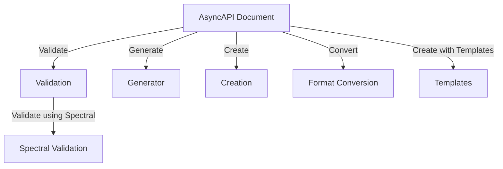
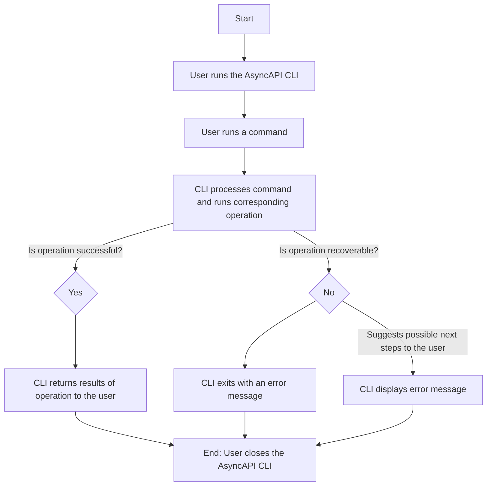

The AsyncAPI CLI is a command-line tool that provides developers with a set of commands for working with AsyncAPI documents. AsyncAPI is a specification for describing asynchronous APIs, which allows developers to define the structure of messages exchanged between different parts of their application. The AsyncAPI CLI simplifies the process of creating, validating, and manipulating AsyncAPI documents, making it easier to work with asynchronous APIs.

## Features

The AsyncAPI CLI offers the following key features:

* Validation: AsyncAPI documents can be quickly and easily validated using the built-in validation tool, which ensures that the documents conform to the AsyncAPI specification and catches errors early in the development process.
  
* Generator: New AsyncAPI documents can be created based on templates using the CLI's Generator tool, saving time and effort when creating new APIs and ensuring that they follow best practices.

* Creation: New AsyncAPI documents can be created from scratch using the CLI, which is useful when starting a new project or needing to create a new version of an existing API.
  
* Format Conversion: AsyncAPI documents can be converted between different formats, such as YAML and JSON, using the CLI, which can be useful when working with a tool that requires a specific format.
  
* Templates: New AsyncAPI files can be quickly created using the CLI tool by selecting from a range of templates (MQTT, WebSockets, Kafka, and more).
  
* Validation with Spectral: AsyncAPI documents can be validated with Spectral, providing feedback to verify that the document is within the correct format.
  
To summarize, the AsyncAPI CLI offers the following features and process flow, as shown in the diagram below:

## AsyncAPI CLI Flowchart

The following flowchart illustrates the process flow of the AsyncAPI CLI:

This flowchart shows the high-level process that occurs when using the AsyncAPI CLI. The user starts by running a command (such as `validate`, `generate`, or `info`), which is processed by the CLI. The CLI then performs the corresponding operation (such as validating or generating an AsyncAPI document), and returns the results to the user. If an error occurs, the CLI displays an error message and suggests possible next steps for the user to take.
