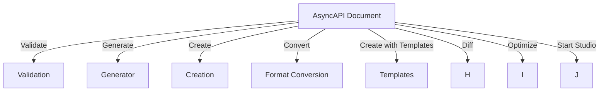
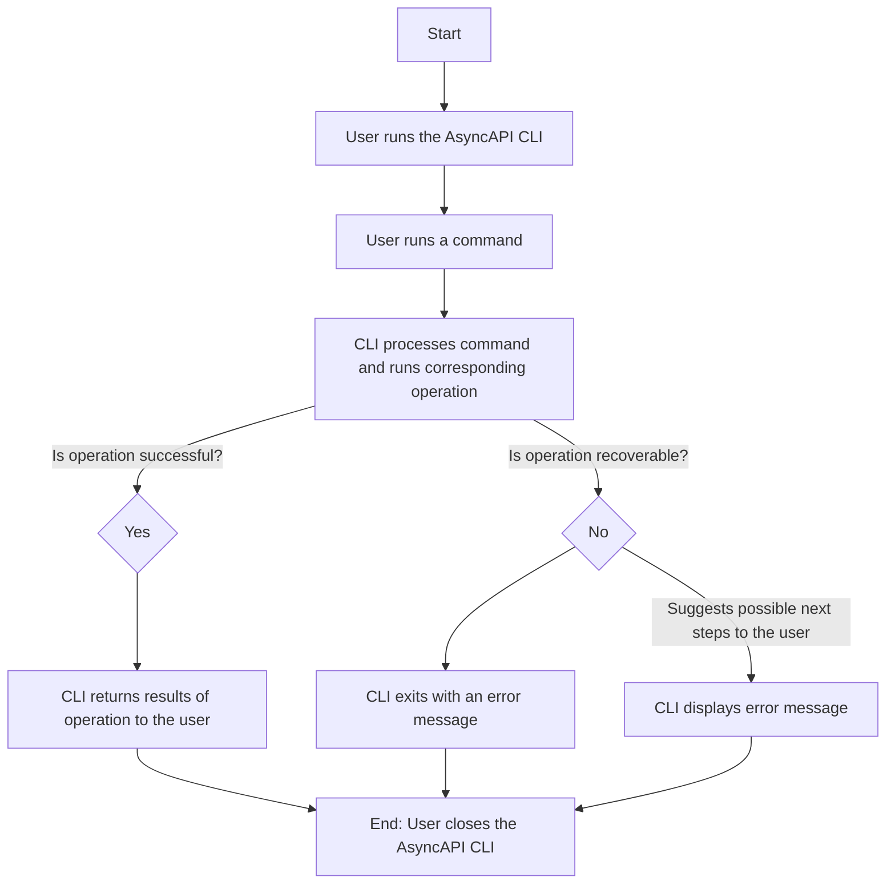

The AsyncAPI CLI is a command-line tool that provides developers with a set of commands for working with AsyncAPI documents. AsyncAPI is a specification for describing asynchronous APIs, which allows developers to define the structure of messages exchanged between different parts of their application. The AsyncAPI CLI simplifies the process of creating, validating, and manipulating AsyncAPI documents, making it easier to work with asynchronous APIs.

## Features

The AsyncAPI CLI offers the following key features:

* Creation: New AsyncAPI documents can be created from scratch using the CLI, which is useful when starting a new project or needing to create a new version of an existing API.

* Validation: AsyncAPI documents can be quickly and easily validated using the [AsyncAPI Parser](https://github.com/asyncapi/parser-js), which ensures that the documents conform to the AsyncAPI specification and catches errors early in the development process.

* Conversion: The AsyncAPI CLI can be used to convert AsyncAPI documents from one version to another. This is useful for migrating APIs to a newer version of the AsyncAPI specification.

* Difference: The AsyncAPI CLI can be used to find the differences between two AsyncAPI documents. This is useful for comparing different versions of an API or for identifying changes that have been made to an API.
  
* Generator: The AsyncAPI CLI includes a powerful tool called the Generator, which allows you to generate various types of documentation, applications, and models in different programming languages. The Generator leverages external libraries like [Generator](https://github.com/asyncapi/generator) and [Modelina](https://github.com/asyncapi/modelina) to automate the creation of new APIs, ensuring they follow best practices. This feature can save a significant amount of time and effort when creating new APIs.

* Optimize: The AsyncAPI CLI can be used to optimize an AsyncAPI specification file. This can improve the performance of APIs and make them easier to understand.

* Start: The AsyncAPI CLI can be used to start AsyncAPI Studio. This is a web-based tool that can be used to view, edit, and test AsyncAPI documents.

* Format Conversion: The AsyncAPI CLI offers seamless conversion of AsyncAPI documents between different formats, such as YAML and JSON, through integration with the [AsyncAPI Converter](https://github.com/asyncapi/converter-js). This feature is helpful when working with tools that require a specific document format.
  
To summarize, the AsyncAPI CLI offers the following features and process flow, as shown in the diagram below:

## AsyncAPI CLI Flowchart

The following flowchart illustrates the process flow of the AsyncAPI CLI:

This flowchart shows the high-level process that occurs when using the AsyncAPI CLI. The user starts by running a command (such as `validate`, `generate`, or `start`), which is processed by the CLI. The CLI then performs the corresponding operation (such as validating or generating an AsyncAPI document), and returns the results to the user. If an error occurs, the CLI displays an error message and suggests possible next steps for the user to take.
