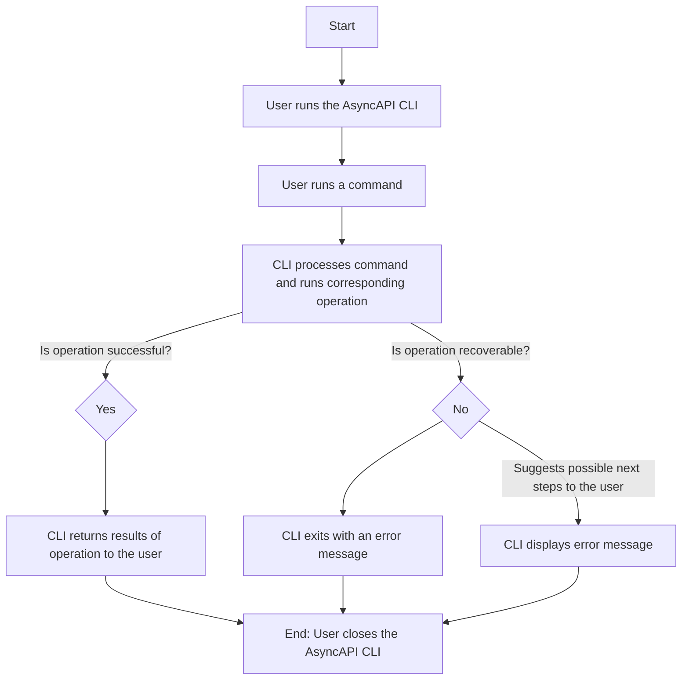

The AsyncAPI CLI is a command-line tool that provides developers with a set of commands for working with AsyncAPI documents. AsyncAPI is a specification for describing asynchronous APIs, which allows developers to define the structure of messages exchanged between different parts of their application. The AsyncAPI CLI simplifies the process of creating, validating, and manipulating AsyncAPI documents, making it easier to work with asynchronous APIs.

## Features

The AsyncAPI CLI offers the following key features:

### Validation
Validate AsyncAPI documents quickly and easily using the CLI's built-in validation tool. This ensures that your documents conform to the AsyncAPI specification and catch errors early in the development process.

### Generator
Create new AsyncAPI documents based on templates using the CLI's Generator tool. This can save you time and effort when creating new APIs and ensure that they follow best practices.

### Creation
Create new AsyncAPI documents from scratch using the CLI. This is useful if you're starting a new project or need to create a new version of an existing API.

### Format Conversion
Convert AsyncAPI documents between different formats, such as YAML and JSON, using the CLI. This can be useful if you need to work with a tool that requires a specific format.

## AsyncAPI CLI Flowchart

The following flowchart illustrates the process flow of the AsyncAPI CLI:

This flowchart shows the high-level process that occurs when using the AsyncAPI CLI. The user starts by running a command (such as 'validate', 'generate', or 'info'), which is processed by the CLI. The CLI then performs the corresponding operation (such as validating or generating an AsyncAPI document), and returns the results to the user. If an error occurs, the CLI displays an error message and suggests possible next steps for the user to take.
