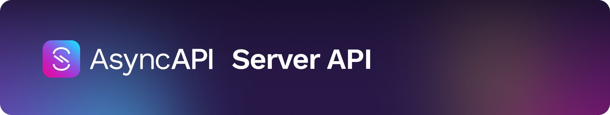

[](https://www.asyncapi.com)

Server API providing official AsyncAPI tools.

## :loudspeaker: ATTENTION:

This package is still under development and has not published and reached version 1.0.0 yet. This means that its API may contain breaking changes until we're able to deploy the first stable version and begin semantic versioning.

---

<!-- toc is generated with GitHub Actions do not remove toc markers -->

<!-- toc -->

- [Requirements](#requirements)
- [Using it locally](#using-it-locally)
- [Using it via Docker](#using-it-via-docker)
- [Development](#development)
- [Deployment](#deployment)
  * [How the GitHub workflow works](#how-the-github-workflow-works)
- [Contribution](#contribution)
- [Supported by](#supported-by)
- [Contributors](#contributors)

<!-- tocstop -->

## Requirements

- [NodeJS](https://nodejs.org/en/) >= 14

## Using it locally

Run:

```bash
npm install
npm run api:prod
```

server is ready to use on [http://localhost:80](http://localhost:80).

## Using it via Docker

Run:

```bash
docker run -it -p 80:80 asyncapi/server-api
```

server is ready to use on [http://localhost:80](http://localhost:80).

## Development

1. Setup project by installing dependencies `npm install`
2. Write code and tests.
3. Make sure all tests pass `npm test`

## Deployment

This project is deployed to [DigitalOcean App Platform](https://www.digitalocean.com/products/app-platform/) using [Terraform](https://www.terraform.io/) and [GitHub Actions](https://www.github.com/digitalocean/app_action/). To deploy it to your own account, follow these steps:

1. Fork this repository.
2. Create a [DigitalOcean Personal Access Token](https://cloud.digitalocean.com/account/api/tokens) with `read` and `write` permissions. For more information, see [DigitalOcean's documentation](https://docs.digitalocean.com/reference/api/create-personal-access-token/).
3. Run `terraform init` to initialize the Terraform project as can be seen [here](./deployments/apps/main.tf). This should be run being located at ./deployments/apps directory preferably.
4. Run `terraform apply` to create the necessary infrastructure. 

> [!NOTE]
> You need to export the following environment variables before running `terraform apply`:
> - `DIGITALOCEAN_ACCESS_TOKEN`: Your DigitalOcean Personal Access Token.


### How the GitHub workflow works

The [GitHub workflow](./.github/workflows/release-docker.yml) is triggered when a new tag is pushed to the repository. It will build a new Docker image and push it to the [Docker Hub](https://hub.docker.com/r/asyncapi/server-api) repository. Then the [DigitalOcean App Platform GitHub Action](https://www.github.com/digitalocean/app_action/) updates the application with the new image.

## Contribution

Read [CONTRIBUTING](https://github.com/asyncapi/.github/blob/master/CONTRIBUTING.md) guide.

## Supported by

<p>
  <a href="https://www.digitalocean.com/">
    
  </a>
</p>

## Contributors

Thanks goes to these wonderful people ([emoji key](https://allcontributors.org/docs/en/emoji-key)):

<!-- ALL-CONTRIBUTORS-LIST:START - Do not remove or modify this section -->
<!-- prettier-ignore-start -->
<!-- markdownlint-disable -->
<table>
  <tbody>
    <tr>
      <td align="center" valign="top" width="14.28%"><a href="https://github.com/magicmatatjahu"><br /><sub><b>Maciej Urbańczyk</b></sub></a><br /><a href="#maintenance-magicmatatjahu" title="Maintenance">🚧</a> <a href="https://github.com/asyncapi/server-api/commits?author=magicmatatjahu" title="Code">💻</a> <a href="https://github.com/asyncapi/server-api/commits?author=magicmatatjahu" title="Documentation">📖</a> <a href="https://github.com/asyncapi/server-api/issues?q=author%3Amagicmatatjahu" title="Bug reports">🐛</a> <a href="#ideas-magicmatatjahu" title="Ideas, Planning, & Feedback">🤔</a> <a href="https://github.com/asyncapi/server-api/pulls?q=is%3Apr+reviewed-by%3Amagicmatatjahu" title="Reviewed Pull Requests">👀</a> <a href="https://github.com/asyncapi/server-api/commits?author=magicmatatjahu" title="Tests">⚠️</a> <a href="#infra-magicmatatjahu" title="Infrastructure (Hosting, Build-Tools, etc)">🚇</a> <a href="#mentoring-magicmatatjahu" title="Mentoring">🧑‍🏫</a></td>
      <td align="center" valign="top" width="14.28%"><a href="https://bolt04.github.io/react-ultimate-resume/"><br /><sub><b>David Pereira</b></sub></a><br /><a href="#maintenance-BOLT04" title="Maintenance">🚧</a> <a href="https://github.com/asyncapi/server-api/commits?author=BOLT04" title="Code">💻</a> <a href="https://github.com/asyncapi/server-api/commits?author=BOLT04" title="Documentation">📖</a> <a href="https://github.com/asyncapi/server-api/issues?q=author%3ABOLT04" title="Bug reports">🐛</a> <a href="#ideas-BOLT04" title="Ideas, Planning, & Feedback">🤔</a> <a href="https://github.com/asyncapi/server-api/pulls?q=is%3Apr+reviewed-by%3ABOLT04" title="Reviewed Pull Requests">👀</a> <a href="https://github.com/asyncapi/server-api/commits?author=BOLT04" title="Tests">⚠️</a> <a href="#infra-BOLT04" title="Infrastructure (Hosting, Build-Tools, etc)">🚇</a> <a href="#mentoring-BOLT04" title="Mentoring">🧑‍🏫</a></td>
      <td align="center" valign="top" width="14.28%"><a href="https://github.com/smoya"><br /><sub><b>Sergio Moya</b></sub></a><br /><a href="#maintenance-smoya" title="Maintenance">🚧</a> <a href="https://github.com/asyncapi/server-api/commits?author=smoya" title="Code">💻</a> <a href="https://github.com/asyncapi/server-api/commits?author=smoya" title="Documentation">📖</a> <a href="https://github.com/asyncapi/server-api/issues?q=author%3Asmoya" title="Bug reports">🐛</a> <a href="#ideas-smoya" title="Ideas, Planning, & Feedback">🤔</a> <a href="https://github.com/asyncapi/server-api/pulls?q=is%3Apr+reviewed-by%3Asmoya" title="Reviewed Pull Requests">👀</a> <a href="https://github.com/asyncapi/server-api/commits?author=smoya" title="Tests">⚠️</a> <a href="#infra-smoya" title="Infrastructure (Hosting, Build-Tools, etc)">🚇</a> <a href="#mentoring-smoya" title="Mentoring">🧑‍🏫</a></td>
      <td align="center" valign="top" width="14.28%"><a href="https://ritik307.github.io/portfolio/"><br /><sub><b>Ritik Rawal</b></sub></a><br /><a href="https://github.com/asyncapi/server-api/commits?author=ritik307" title="Code">💻</a> <a href="https://github.com/asyncapi/server-api/commits?author=ritik307" title="Documentation">📖</a></td>
      <td align="center" valign="top" width="14.28%"><a href="https://everly-precia.netlify.app/"><br /><sub><b>Everly Precia Suresh</b></sub></a><br /><a href="https://github.com/asyncapi/server-api/commits?author=everly-gif" title="Code">💻</a> <a href="https://github.com/asyncapi/server-api/commits?author=everly-gif" title="Documentation">📖</a></td>
      <td align="center" valign="top" width="14.28%"><a href="http://ashishpadhy.live"><br /><sub><b>Ashish Padhy</b></sub></a><br /><a href="https://github.com/asyncapi/server-api/commits?author=Shurtu-gal" title="Documentation">📖</a> <a href="#infra-Shurtu-gal" title="Infrastructure (Hosting, Build-Tools, etc)">🚇</a></td>
    </tr>
  </tbody>
</table>

<!-- markdownlint-restore -->
<!-- prettier-ignore-end -->

<!-- ALL-CONTRIBUTORS-LIST:END -->

This project follows the [all-contributors](https://github.com/all-contributors/all-contributors) specification. Contributions of any kind welcome!
